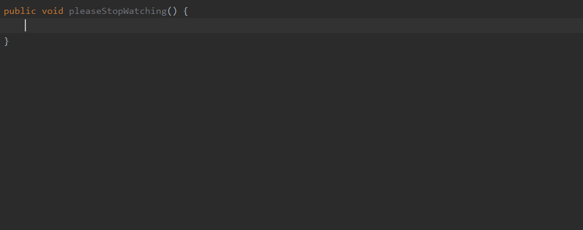
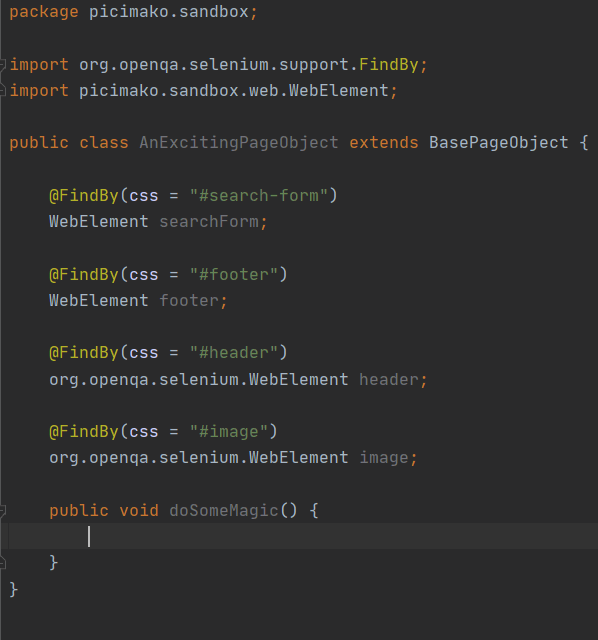
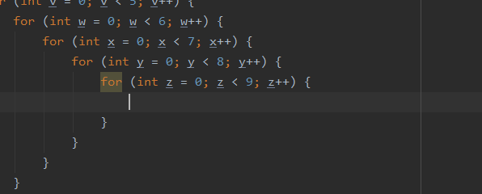
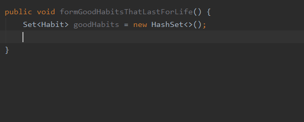
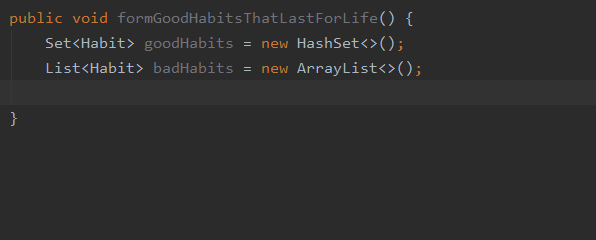

# Misc

## clipboard()

Just like what you'd expect, quoting the official documentation it *"Returns the contents of the system clipboard."*

**Related macro:** [ClipboardMacro](https://github.com/JetBrains/intellij-community/blob/master/platform/lang-impl/src/com/intellij/codeInsight/template/macro/ClipboardMacro.java)

## complete()

Invokes code completion at the position of the variable.

For the sake of an example let's say I would like a live template to create new `HashMap` instances with an initial capacity that I get passed in from somewhere.
A template can be:

```java
java.util.Map<String, String> $name$ = new java.util.HashMap<>($capacity$);
```

Then you can configure `$capacity$` with the `complete()` macro which will trigger the code completion:


**Official documentation:** [Code completion/Basic completion](https://www.jetbrains.com/help/idea/auto-completing-code.html#basic_completion)

**Related macro:** [CompleteMacro](https://github.com/JetBrains/intellij-community/blob/master/platform/lang-impl/src/com/intellij/codeInsight/template/macro/CompleteMacro.java)

## completeSmart()

Invokes smart type completion at the position of the variable.

Let's say you would like to create an instance of Google Guava's `StopWatch` including querying the elapsed time, which code snippet will surround your code to be developed.

For that you might assemble for the following template:

```java
com.google.common.base.Stopwatch stopwatch = Stopwatch.createStarted();
        
//do something

long elapsedTime = stopwatch.elapsed($timeunit$);
```

The only thing needing configuration is the `$timeunit$` variable whose Expression value will be `completeSmart()`. Then at the place of this variable
the smart type completion will appear.



**Official documentation:** [Code completion#Smart completion](https://www.jetbrains.com/help/idea/auto-completing-code.html#smart_completion)

**Related macro:** [CompleteSmartMacro](https://github.com/JetBrains/intellij-community/blob/master/platform/lang-impl/src/com/intellij/codeInsight/template/macro/CompleteSmartMacro.java)

## date(sDate)

Returns the current system date in the specified format.

Let's say, for some reason, you like to keep track when you did certain changes in your code and you'd like to insert the current date and/or time
as a comment or into your javadoc. For that a template might be:

```java
//Latest modification: $currentDate$
```

The only thing you need to configure is the Expression part of the `$currentDate$` variable which can be done multiple ways.

#### No date format

In case there is no parameter specific for the `date()` macro, as the official documentation also states
     
> the current date is returned in the default system format.

You can be on Mac, Unix or Windows, it will return the date in its default system format. All this logic is handled in `com.intellij.util.text.DateFormatUtil`.


#### Single custom date format

If you'd like to use a different date format you can pass in a date-time format String value that is according to the `java.text.SimpleDateFormat` specification.

Using the format `"Y-MM-d, E, H:m"` the result will change as following: 


**NOTE:** this example is made on a Hungarian language system, so the current day abbreviation is according to that: V for Vasárnap, Sunday in Hungarian. 

#### Multiple macro parameters

The macro takes only one parameter and ignores all extra parameters, but according to the macro implementation if you pass in more than one parameters,
it acts as if there were no parameters specified at all, falling back to the default system format.

#### Invalid date format

If you specify a custom date format string but it is not valid according to the `SimpleDateFormat` specification, e.g. `"Y-MM-d, E, H:mmmXSAm"`,
it returns an error message defined in the macro implementation, `com.intellij.codeInsight.template.macro.CurrentDateMacro`.


**Related macro:** [CurrentDateMacro](https://github.com/JetBrains/intellij-community/blob/master/platform/lang-impl/src/com/intellij/codeInsight/template/macro/CurrentDateMacro.java)

## groovyScript("groovy code", arg1)

Returns a Groovy script with the specified code.

**Related macro:** [GroovyScriptMacro](https://github.com/JetBrains/intellij-community/blob/master/platform/lang-impl/src/com/intellij/codeInsight/template/macro/GroovyScriptMacro.java)

## lineNumber()

Returns the line number at which the associated template parameter is positioned after invoking the live template.

Considering that the live template is invoked in the 11th line, the results would be the following:

| Template | Result  |
|---|---|
| <pre>lineNumber$</pre> | 11 |
| <pre>$start$<br><br><br>$lineNumber$</pre> | 14 |

**Related macro:** [LineNumberMacro](https://github.com/JetBrains/intellij-community/blob/master/platform/lang-impl/src/com/intellij/codeInsight/template/macro/LineNumberMacro.java)

## showParameterInfo()

NOTE: This is not included in the official documentation at the moment.

While you are defining the parameters passed to a method or an annotation, a little tooltip on top of the parameter list is displayed with all the signatures that match the current state of passed parameters.
In some cases all signatures or options are shown but the most relevant to the typed text is highlighted in that list.

The tooltip cannot be interacted with, so for example your cannot select a signature/option from that list to pre-populate the required number of parameter separator commas.

### Annotation parameters

In case of one annotation attribute it doesn't matter if you use a single template variable for the whole value (including the attribute name),
or define the attribute name and its value separately, the tooltip is displayed regardless. Below are two examples for a single annotation attribute. 

#### One attribute
```java
@org.openqa.selenium.support.FindBy($strategy$)
org.openqa.selenium.WebElement $element$;
```


```java
@org.openqa.selenium.support.FindBy(css = $locator$)
org.openqa.selenium.WebElement $element$;
```


#### Multiple attributes
In case of multiple annotation attributes (and template variables), the parameter info tooltip is displayed only when you start defining the value of the template variable
this macro is added to. From that point on, it is displayed for any further attributes.

```java
@io.cucumber.junit.CucumberOptions(tags = "$tags$", features = "$features$")
```


### Method call parameters

In case of method call parameters this macro behaves the same way as it behaves in case of annotations.

```java
List<String> items = java.util.List.copyOf($params$);
```


In case of multiple parameters:
> ... (and template variables), the parameter info tooltip is displayed only when you start defining the value of the template variable
  this macro is added to. From that point on, it is displayed for any further parameters.

```java
List<String> items = java.util.List.of($params$, $param2$);
```


**Related Bug ticket:** [showParameterInfo() macro tooltip causes the red rectangle to not appear](https://youtrack.jetbrains.com/issue/IDEA-237488)

**Related macro:** [ShowParameterInfoMacro](https://github.com/JetBrains/intellij-community/blob/master/platform/lang-impl/src/com/intellij/codeInsight/template/macro/ShowParameterInfoMacro.java)

## suggestFirstVariableName(sFirstVariableName)

Quoting from a related [JetBrains support ticket](https://intellij-support.jetbrains.com/hc/en-us/community/posts/360007850440-Live-template-How-does-suggestFirstVariableName-macro-work-) (kudos to Olga Klisho):

> `suggestFirstVariableName` macro is the same as [`variableOfType`](../types/types.md#variableoftypetype), both suggest variables of the given type available in the context,
> but the latter one also suggests "standard expressions" if they have a compatible type: "true", "false", "this" and "Outer.this".

> The arguments can look like `"double"` or `"java.util.Collection"` or other macros, e.g. `methodReturnType()`
> which returns the return type of the method where the caret is positioned.

### Primitive types

Primitive types can be specified by their names as the macro's parameter, like: `suggestFirstVariableName("short")`.

Let's say you have the index of some special days stored in `short` type fields, and with a live template you'd like to
create `short` variables with name suggestions.

```java
short $aSpecialDay$ = $day$;
```

Then you can configure the `$day$` variable's Expression as `suggestFirstVariableName("short")`.

In case of specifying a primitive type as the parameter of this macro, the suggestions list
will show variables of their respective non-primitive types as well (including `java.lang.Void` for the keyword `void`).


### Non-primitive types

Let's say you are doing UI test automation with Selenium, and you have a bunch of Page Object classes that all extend a base class.

This base class has a method with which you can query a custom HTML attribute in your application, from a `WebElement` , in a more readable way:

```java
public String customDataAttrOf(WebElement element) {
    //return custom attribute value from 'element'
}
```

If you create a template for inserting this method e.g.:

```java
customDataAttrOf($WebElement$);
```

you can also configure the `$WebElement$` variable's Expression to be `suggestFirstVariableName("org.openqa.selenium.WebElement")` so that when inserted,
all the WebElement type variable names are shown as suggestions.

Variable names with the specified type are collected from super classes as well.


If you pass a type into the macro but not with its fully qualified name, e.g. `"WebElement"` instead of `"org.openqa.selenium.WebElement"`, and you have
a custom type with the same name, then upon insertion, the suggestions will show variables only whose type is actually imported into the current class.

When you are aware of that multiple types with the same name might exist and be available in your project, it might be better to use fully qualified names,
otherwise the simple name of the type may be more feasible.

 

### Macros

Other macros that return a type can also be specified as the parameter of this macro, so that this one will suggest variable names
according to the returned type.

One example is [`methodReturnType()`](../types/types.md#methodreturntype), in which case the Expression will be `suggestFirstVariableName(methodReturnType())` when configured in a template variable.

In case it doesn't find a variable with the returned type, then the suggestions list will be empty.

### Edge cases

This macro accepts exactly one parameter, so either there is no parameter, or multiple parameters specified the suggestions list will be ewmpty.

**Related macro:** [SuggestFirstVariableNameMacro](https://github.com/JetBrains/intellij-community/blob/master/java/java-impl/src/com/intellij/codeInsight/template/macro/SuggestFirstVariableNameMacro.java)

## suggestIndexName()

Suggests the name of an index variable from most commonly used ones: i, j, k, and so on (first one that is not used in the current scope).

For this I'm going to use the built-in template called **fori**:

```java
for(int $INDEX$ = 0; $INDEX$ < $LIMIT$; $INDEX$++) {
  $END$
}
```

where the Expression part of `$INDEX$` is `suggestIndexName()`.

The index suggestions start at **i** and goes all the way to **z**.


In case the template (and along with that the macro) is invoked at a place where the outmost iterations index variable's name is "greater" (in terms of ASCII char index) than **i**,
e.g. j, k and so on, the name suggestion starts at **i** again.


If the template is invoked in an iteration where the index variable name is **z**, from that point on the next suggested variable name will always be an empty string.



**Related macro:** [SuggestIndexNameMacro](https://github.com/JetBrains/intellij-community/blob/master/java/java-impl/src/com/intellij/codeInsight/template/macro/SuggestIndexNameMacro.java)

## suggestVariableName()

Suggests the name for a variable based on the variable type and its initializer expression...

This example is based on the built-in template called **iter** whose template is:

```java
for ($ELEMENT_TYPE$ $VAR$ : $ITERABLE_TYPE$) {
  $END$
}
```

having the Expression part of `$VAR$` set to `suggestVariableName()`.

In case the source iterable's name is in plural form, then the suggested variable's name is going to be in singular form: 
 


Though not necessarily related, when there are multiple iterables suggested, the `suggestVariableName()` macro will always suggests
a name according to the currently selected iterable.



If the source iterable's name is not in plural the suggestion will either be a predefined name or the lowercase version of the
variable's name.

In certain cases when there would be name collision, the suggested variable name is indexed to make it unique.

| Type | Suggested variable name |
|---|---|
| String | (Collection item type + collection name -> suggested variable name)<br>String + integer -> s<br>String + string -> s<br>String + strings -> string<br>String + s -> s1<br>String + s1 -> s |
| Integer | <br>Integer + integer -> integer1<br>Integer + string -> integer<br>Integer + integers -> integer<br>Integer + i -> integer |
| Custom types | the lowercase version of the type: AnAwesomeClassName -> anawesomeclassname |

**Related macro:** [SuggestVariableNameMacro](https://github.com/JetBrains/intellij-community/blob/master/java/java-impl/src/com/intellij/codeInsight/template/macro/SuggestVariableNameMacro.java)

## time(sSystemTime)

Returns the current system time in the specified format.

The underlying logic is almost the same as in case of the `date(sDate)` macro because they are both handled in the `com.intellij.codeInsight.template.macro.CurrentDateMacro` class
in a common static method. The only difference is that in case of there is no parameter specified for `time(sSystemTime)`
the system default time is returned instead of the system default date.

For the sake of comprehensiveness I include all the cases from the `date(sDate)` macro here as well, of course extended with the `time` specific details.

Let's say, for some reason, you like to keep track when you did certain changes in your code and you'd like to insert the current time
as a comment or into your javadoc. For that a template might be:

```java
//Latest modification: $currentTime$
```

The only thing you need to configure is the Expression part of the `$currentTime$` variable which can be done multiple ways.

#### No time format

In case there is no parameter specific for the `time()` macro, as the official documentation also states
     
> the current time is returned in the default system format.

You can be on Mac, Unix or Windows, it will return the time in its default system format. All this logic is handled in `com.intellij.util.text.DateFormatUtil`.


#### Single custom time format

If you'd like to use a different time format you can pass in a date-time format String value that is according to the `java.text.SimpleDateFormat` specification.

Using the format `"H.mm"` the result will change as following: 


However nothing stops you from defining a complete date format as well because behind the scenes it uses a `SimpleDateFormat` to get the time.

`"Y-MM-d, E, H:m"`


**NOTE:** this example is made on a Hungarian language system, so the current day abbreviation is according to that: V for Vasárnap, Sunday in Hungarian. 

#### Multiple macro parameters

The macro takes only one parameter and ignores all extra parameters, but according to the macro implementation if you pass in more than one parameters,
it acts as if there were no parameters specified at all, falling back to the default system format.

#### Invalid time format

If you specify a custom time format string but it is not valid according to the `SimpleDateFormat` specification, e.g. `"H:mmmXSAm"`,
it returns an error message defined in the macro implementation, `com.intellij.codeInsight.template.macro.CurrentDateMacro`.


**Related macro:** [CurrentTimeMacro](https://github.com/JetBrains/intellij-community/blob/master/platform/lang-impl/src/com/intellij/codeInsight/template/macro/CurrentTimeMacro.java)

## user()

Returns the name of the current system user, more specifically the value of the `user.name` system property.

**Related macro:** [CurrentUserMacro](https://github.com/JetBrains/intellij-community/blob/master/platform/lang-impl/src/com/intellij/codeInsight/template/macro/CurrentUserMacro.java)
