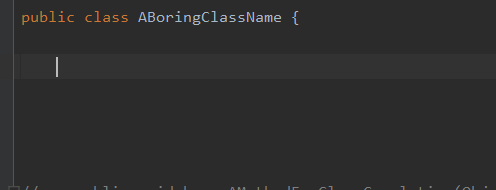

# Types

## anonymousSuper()

Suggests a supertype for a Kotlin object expression.

**Related macro:** ???

## castToLeftSideType()

Casts the right-side expression to the left-side expression type.
It is used in the iterations group to have a single template for generating both raw-type and Generics Collections.

**Related macro:** [CastToLeftSideTypeMacro](https://github.com/JetBrains/intellij-community/blob/master/java/java-impl/src/com/intellij/codeInsight/template/macro/CastToLeftSideTypeMacro.java)

## className()

Returns the name of the current class (the class where the template is expanded).

Let's say you need a static slf4j logger in your class fully initialized. A live template for that may look like this:

```java
private static final org.slf4j.Logger LOGGER = org.slf4j.LoggerFactory.getLogger($CurrentClass$.class);
```

where the `getLogger()` method must be parameterized by the current class name.

To populate that part automagically you can configure the Expression part of the `$CurrentClass$` variable to `className()`.
That way the parameter will always take the name of the class the logger is placed in.


**Related macro:** [ClassNameMacro](https://github.com/JetBrains/intellij-community/blob/master/java/java-impl/src/com/intellij/codeInsight/template/macro/ClassNameMacro.java)

## classNameComplete()
	
This expression substitutes for the class name completion at the variable position.

Let's say you would like to insert a snippet of for validating whether an object is an instance of a type, via AssertJ.
A live template might be:

```java
org.assertj.core.api.Assertions.assertThat($instance$).isInstanceOf($Class$.class);
```

If you configure the `$Class$` variables Expression with `classNameComplete()`, then suggestions are offered at the place of that variable for any kind of types
including classes, interfaces, etc.


**Related macro:** [ClassNameCompleteMacro](https://github.com/JetBrains/intellij-community/blob/master/platform/lang-impl/src/com/intellij/codeInsight/template/macro/ClassNameCompleteMacro.java)

## defaultReturnValues / errorVariableName

Returns the default value if the expression is used in the return statement. Uses the errorVariableName parameter if the expression is of the error type.

NOTE: these are variable names and not macros

## descendantClassesEnum(<String>)

Returns the children of the class specified as a string parameter.

NOTE: The official documentation now includes this macro as `descendantClassEnum(String)` but its latest name is `descendantClassesEnum(String)`.

**Related macro:** [DescendantClassesEnumMacro](https://github.com/JetBrains/intellij-community/blob/master/java/java-impl/src/com/intellij/codeInsight/template/macro/DescendantClassesEnumMacro.java)

## enum(sCompletionString1,sCompletionString2,...)

Returns a list of comma-separated strings suggested for completion when the template is expanded.

Selenium's `By` type fields/variables might be a good candidate to demonstrate this macro. A template text might be the following:

```java
final org.openqa.selenium.By $by$ = By.$strategy$("$selector$");
```

One might configure the Expression part of `$strategy$` with `completeSmart()` which would provide suggestions for all available methods (locator strategies) under `By`. 
However usually people only use a portion of these strategies so you may want to limit the number of suggested items that you can do with the `enum(...)` macro.

You can define a list of Strings that will be populated into the suggestions list. In this case the list could be limited to cssSelector, id and className which three might be the three most commonly
used ones.

So, the Expression part of `$strategy$` will be. If you want to save time further you can also set the default value for this variable to your desired one, e.g. `"cssSelector"`.



**Related macro:** [EnumMacro](https://github.com/JetBrains/intellij-community/blob/master/platform/lang-impl/src/com/intellij/codeInsight/template/macro/EnumMacro.java)

## expectedType()

Returns the expected type of the expression into which the template expands. Makes sense if the template expands in the right part of an assignment, after return, and so on.

**Related macro:** [ExpectedTypeMacro](https://github.com/JetBrains/intellij-community/blob/master/java/java-impl/src/com/intellij/codeInsight/template/macro/ExpectedTypeMacro.java)

## guessElementType(<container>)

Makes a guess on the type of elements stored in a java.util.Collection. To make a guess, IntelliJ IDEA tries to find the places where the elements were added to or extracted from the container.

**Related macro:** [GuessElementTypeMacro](https://github.com/JetBrains/intellij-community/blob/master/java/java-impl/src/com/intellij/codeInsight/template/macro/GuessElementTypeMacro.java)

## methodName()

Returns the name of the method in which the template is expanded.

**Related macro:** [MethodNameMacro](https://github.com/JetBrains/intellij-community/blob/master/java/java-impl/src/com/intellij/codeInsight/template/macro/MethodNameMacro.java)

## methodParameters()

Returns the list of parameters of the method in which the template is expanded.

**Related macro:** [MethodParametersMacro](https://github.com/JetBrains/intellij-community/blob/master/java/java-impl/src/com/intellij/codeInsight/template/macro/MethodParametersMacro.java)

## methodReturnType()

Returns the type of the value returned by the current method (in which the template is expanded).

**Related macro:** [MethodReturnTypeMacro](https://github.com/JetBrains/intellij-community/blob/master/java/java-impl/src/com/intellij/codeInsight/template/macro/MethodReturnTypeMacro.java)

## qualifiedClassName()

Returns the fully qualified name of the current class (in which the template is expanded).

**Related macro:** [QualifiedClassNameMacro](https://github.com/JetBrains/intellij-community/blob/master/java/java-impl/src/com/intellij/codeInsight/template/macro/QualifiedClassNameMacro.java)

## rightSideType()

Declares the left-side variable with a type of the right-side expression. It is used in the iterations group to have a single template for generating both raw-type and Generics Collections.

**Related macro:** [RightSideTypeMacro](https://github.com/JetBrains/intellij-community/blob/master/java/java-impl/src/com/intellij/codeInsight/template/macro/RightSideTypeMacro.java)

## subtypes(sType)

Returns the subtypes of the type passed as the parameter.

**Related macro:** [SubtypesMacro](https://github.com/JetBrains/intellij-community/blob/master/java/java-impl/src/com/intellij/codeInsight/template/macro/SubtypesMacro.java)

## typeOfVariable(VAR)

Returns the type of the variable passed as the parameter.

**Related macro:** [TypeOfVariableMacro](https://github.com/JetBrains/intellij-community/blob/master/java/java-impl/src/com/intellij/codeInsight/template/macro/TypeOfVariableMacro.java)

## variableOfType(<type>)

Suggests all variables that may be assigned to the type passed as the parameter, for example, variableOfType("java.util.Vector"). If you pass an empty string "" as the parameter, the function suggests all variables regardless of their types.

**Related macro:** [VariableOfTypeMacro](https://github.com/JetBrains/intellij-community/blob/master/java/java-impl/src/com/intellij/codeInsight/template/macro/VariableOfTypeMacro.java)

## expressionType(Expression)

NOTE: This is not included in the official documentation at the moment.

**Related macro:** [ExpressionTypeMacro](https://github.com/JetBrains/intellij-community/blob/master/java/java-impl/src/com/intellij/codeInsight/template/macro/ExpressionTypeMacro.java)
